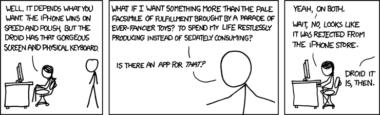

# android-tools

[bash](https://www.wikiwand.com/en/Bash_(Unix_shell)) scripts I use to work with [Android](https://www.wikiwand.com/en/Android_(operating_system)) devices.

* [speed.sh](https://github.com/mickeys/android-tools/blob/master/speed.sh?ts=4) measures computer <-> device eMMC <-> SD Card speeds
* [battstat.sh](https://github.com/mickeys/android-tools/blob/master/battstat.sh?ts=4) generates CSV files capturing the battery status over time. It's perfect for graphing; see how [my gnuplot article](https://github.com/mickeys/gnuplot/blob/master/a_real_world_gnuplot_introduction/README.md).

